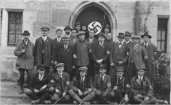

# Intro Weimar Conditions

* Contrary to popular belief there is much more to the Nazi party coming to power than meets the eye.
* The power was `Handed Off` to the party by people's power to prevent the rise of the communist party
* The party was not given power by the German people, they had 43.9 percent of votes, less than `50%`
* Simple minded historians that think is was the German people entirely are wrong!

|Unstable Parliamentary System|
|---|
|↓  |
|Paris Settlement Producing Unrest|
|↓  |
|Economic Issues --> Political Extremism|
|↓  |
|Fear of Left (Communism)|
|↓|
|Power Handed Off The Nazis by `Vested Intrests` to counter communism|
|↓|
|`Seizure of Power`|

| 1 | 2 |
|-|-|
|It showed the progression of German powers putting them in a light of success of what they did. It was intending to show a successful passing of of power eventually to Hitler |Janus-faced means having two different faces, on looking back and one looking forward. Hitler looked back on the previous leaders and a previous German leadership. Hitler is also looking forward how the postcard says "Soldier saved an united"|
