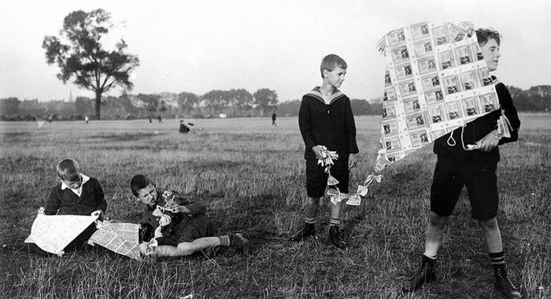
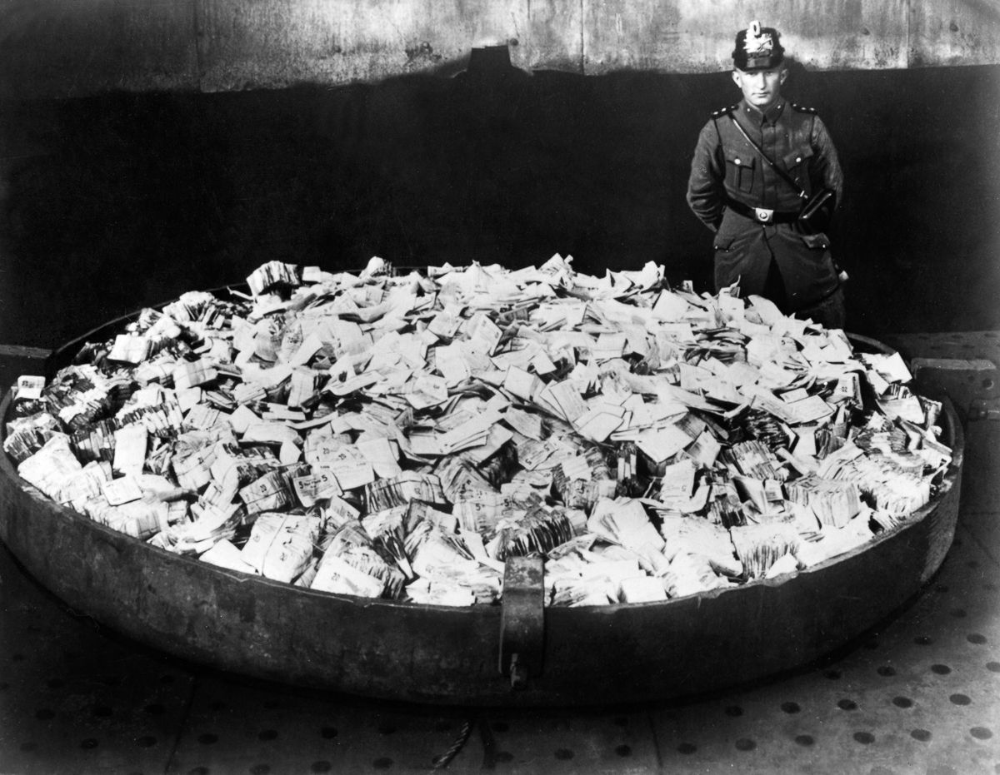

# Germany 1918-45: The Weimar Republic and Hitler

### Beginning Failures
* The acceptance of the `Treaty of Versailles` which was very bad for Germany and would be associated with the Weimar party by nationalists.
* There was a dislike from Germans of the democratic part and the people wanted military control. They thought that the democratic party had back stabbed the military with the treaty
* Even parties with the Weimar constitution made it so that no one party could carry out it's agenda
* Since the `Reichstag` (Lower House) had never run a democratic government system before so no one could compromise. The communists and nationalists refused to compromise so there was nothing that could happen

### Outbreaks of Violence
* `The Spartacist Rising` (January 1919) occupied almost every major city. The government was only able to help them because of the Fraikorps (ex army anti-communists) this showed the weakness of the government, the leaders of the rising were clubbed to death not given a fair trial by the Fraikorps
* `The Kapp Putsch` (March 1920) was a takeover attempt by the Fraikorps when the government tried to disband them. They declared Wolfgang Kapp as the Chancellor it ended in a strike by the workers and Kapp resigned. No one was punished except Kapp himself. The government took no action because they were behind the party. Ex-members later would join Hitler
* Ex-Fraikorps members assassinated two communists `Walter Rathenau (Jewish Foregn Minister` and `Gustav Erzberger (Leader of Armistice Delegation)`. The right wing encouraged it and the courts tended to be anti-Weimar. The government could not do anything.
* `Hitler's Beer Hall Putsch` (November 1923) was an attempted takeover by Hitler, first Munich then a Berlin. It was broken up by the police and he was only sentenced 5 months because of sympathy from the authorities.
* In the early 1930s there were many private armies and regular street fights between communists and Nazis. No meetings could happen for the parties because of rival armies and the police could do nothing. People wanted a return to a authoritarian government.

### Economic Problems
* 1919 Germany almost bankrupt because of war expenses
* 1920 Germany paid €50 Million and asked for a break in payments for their economy France didn't agree and they could not pay in 1922
* January 1923 France occupied the Ruhr (industrial area) to take goods and Germany had workers use passive resistance this tanked the economy and there was crazy inflation
* The mark fell so rapidly in December of 1923 that it would lose value in a day, this was fixed when Chancellor Gustav Stresemann introduced the Rentenmark in 1914

* This hit the middle class very badly but people who owned land were alright. Leaving more power to big business, the middle class looked to the Nazis for improvement
* Economy improved after 1924 because of the `Dawes Plan` which was a loan from the USA for €40 Mil, less payments due for Germany, and french troops left Ruhr. A stabilised currency led to lots of industries doing well and big business was happy with the republic because they were doing well.
# NICE JOB GUSTAV STRESEMANN
* He was Foreign Minister until 1929
* Further good happened with the `Young Plan` in October 1929, fees for Germany went from €6600 Mil ---> €2000 Mil over 59 years.
# NICE JOB GUSTAV STRESEMANN
## Not so good......................😟😟😟😟😟😟
* Germany relied very heavily on the loans from the USA that is something where to happen........(Foreshadowing)
* `Wall Street Crash` October 1929 caused a recall of loans to Germany and caused a run on banks, many of them closed. 
* Because of over production in the industrial boom factories had to close and unemployment reached 4 Mil in 1931
* Stresemann died of a heart attack in October 1929 at 51 
## Bad Bad Bruning 😒
* Chancellor Bruning (CCP) reduced social services, unemployment benefit, and salaries and pension of government officials, and stopped reparations payments. The government increased tariffs to help farmers and bought stock in factories to help them. This was not enough and unemployment was 6 Mil in the spring of 1932. The government lost support of the working class because of the unemployment and benefit from it. The Weimar Republic was at the verge of collapse at the end of 1932.

